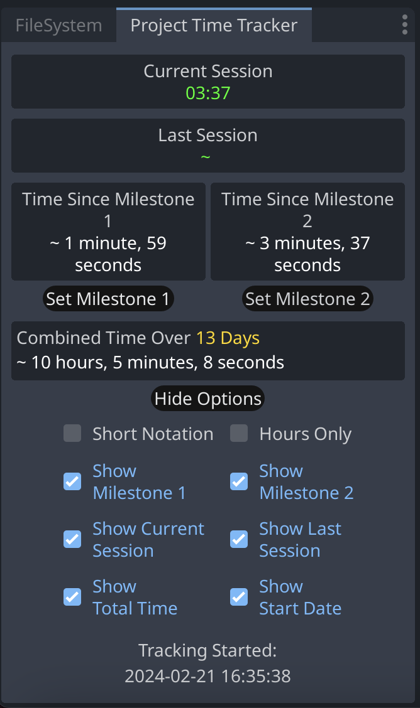

# Project Time Tracker Plugin  

A simple tool to keep track of your project's development time.

Works with Godot 4.2+

## Features
* Current session time.
* Last session time.
* Overall combined real time.
* Overall on/off days since tracking started.
* Automatic tracking start date.

## Installation
* Clone this repository or download it as ZIP. Copy the `addons/project_time_tracker` folder into your project's addons folder.
* Open the plugins menu in Project Settings and enable the `Project Time Tracker` plugin. The first time it runs, a file named `ptt.json` will be created and stored in the "res://" folder.
* Updating the plugin may cause output errors due to some code changes from previous versions. Turning the plugin on/off should fix it.

## Utility Functions Usage
You can now access the values stored in ptt.json through the following utility functions:
* `PTTUtils.tracking_start_time()` returns the date timestamp of when tracking started.
* `PTTUtils.total_active_time()` returns the total (combined sessions) time integer.
* `PTTUtils.total_active_time_string(suffix: String = "elapsed")` returns the total active time in readable string format, suffix defaults to "elapsed" -> "6 hours 2 minutes elapsed"
* `PTTUtils.total_period()` returns the integer of total days of work on the project.
* `PTTUtils.total_period_string(suffix: String = "elapsed")` returns the total days of work on the project in readable string format, suffix defaults to "elapsed" -> "1 month 3 days... elapsed"

Also available on the Godot Asset Library: https://godotengine.org/asset-library/asset/2836

## Credit
Developed for the Godot community by:

| **Victor Majida** | (https://github.com/victormajida) 

and other contributors:

(https://github.com/peachey2k2)
(https://github.com/monk125)

## License

Code licensed under the [MIT License](https://github.com/victormajida/project-time-tracker/blob/main/LICENSE.md).
